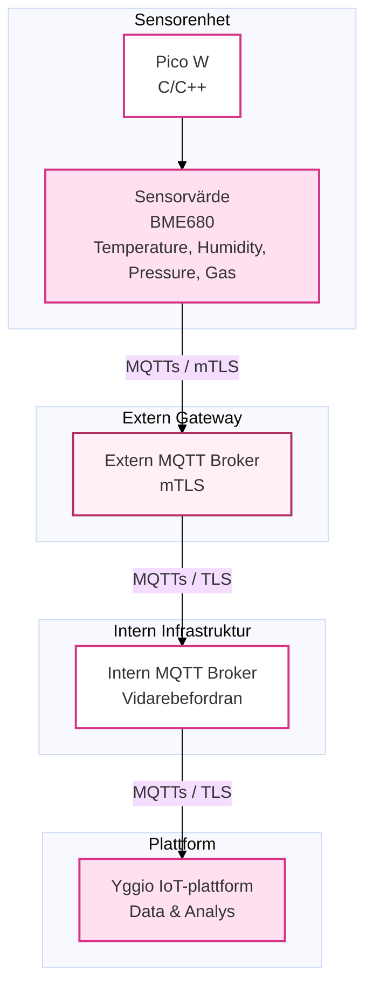

# 🏙️ Pico W Miljömonitor (Yggio mTLS-Integration)
Ett robust IoT-projekt designat för att övervaka inomhusluftkvalitet och miljödata, med fokus på säker och direkt dataöverföring till Stockholms Stads IoT-plattform (Yggio) via mTLS (Mutual TLS).

> Systemet använder en Raspberry Pi Pico W och en BME680-sensor för att mäta temperatur, luftfuktighet, barometertryck och luftkvalitet (VOC/CO₂-ekvivalent).

## 🎯 Projektmål & Höjdpunkter
- Säkerhet i Fokus: Implementera mTLS (Mutual TLS) för säker autentisering mot extern MQTT-broker, med hjälp av klientcertifikat och nyckel (Client.crt/Client.key).

- Realtidsövervakning: Mäta och skicka miljödata från BME680-sensorn.

- Stadsintegration: Direkt publicering av data till Stockholms Stads IoT-plattform (Yggio) via deras dedikerade MQTT-broker.

- Robust Status: Implementera Last Will and Testament (LWT) med separat Topic för att ge en omedelbar Online/Offline-status utan att förorena sensordatan.

## 🗺️ Lösningsarkitektur

Arkitekturen beskriver den säkra dataflödeskedjan där Pico W agerar som en direkt mTLS-klient mot den externa gatewayen, utan mellanhänder.

## ⚙️ Tekniska Komponenter

| Komponent | Funktion | Teknik / Bibliotek |
| :--- | :--- | :--- |
| **Microkontroller** | Primär sensorenhet | Raspberry Pi Pico W |
| **Sensor** | Miljömätning (TVOC/IAQ, T, P, H) | Bosch BME680 |
| **Kärnbibliotek** | Operativsystem & Drivrutiner | Raspberry Pi Pico C/C++ SDK |
| **Kommunikation** | Säker dataöverföring | MQTT över **TLS 1.2** (mbedTLS) |
| **Plattform** | Dataförvaring och visualisering | Yggio IoT Platform |

## 📊 Datavisualisering av mätvärden i realtid: Yggio Dashboard

Bilden nedan visar hur BME680-sensordatan (Temperatur, Luftfuktighet och Gas/Luftkvalitet) visualiseras i realtid efter att den har mottagits säkert via mTLS och MQTT(s) i Yggio IoT Plattform.

## 📂 Projektstruktur

Projektet följer standardiserad Raspberry Pi Pico C/C++ SDK-layout, vilket gör det lätt att navigera och bygga.

| Fil / Katalog | Beskrivning |
| :--- | :--- |
| **`src/main.c`** | Huvudprogrammet. Hanterar Wi-Fi, NTP-synkronisering och den primära programloopen (datainsamling och sändning). |
| **`src/mqtt_client.c/h`** | Implementerar MQTT-klientlogik, **mTLS-autentisering** och hanterar inbäddade maskerade certifikat/nycklar. |
| **`src/pico_transport.c/h`** | Hanterar det underliggande TCP/IP-nätverkslagret och upprättar en säker TLS-tunnel. |
| **`src/config.h`** | **Kritiskt: Måste ignoreras av Git!** Innehåller placeholders för Wi-Fi SSID/Lösenord, Broker Host, Client ID och Topics. |
| **`src/bme680.c/h`** | Applikationsspecifik drivrutin för att initiera och läsa sensordata (T, H, P, Gas) från BME680. |
| **`src/datetime.c/h`** | Hanterar tids-synkronisering via NTP för korrekt tidsstämpling av data. |
| **`BME68x_SensorAPI/`** | Vendor-bibliotek från Bosch (Sensor API). |
| **`pico-sdk/`** | Submodul för Raspberry Pi Pico C/C++ SDK. |
| **`build/`** | Katalog för byggda filer (.elf, .uf2, etc.). (Ignoreras av Git). |
| **`CMakeLists.txt`** | Byggkonfiguration för hela projektet. |

